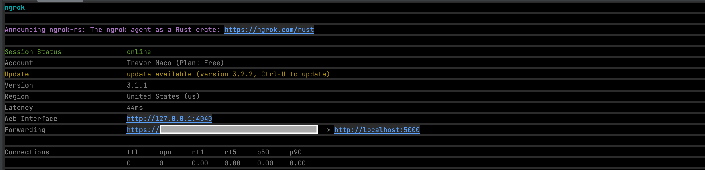
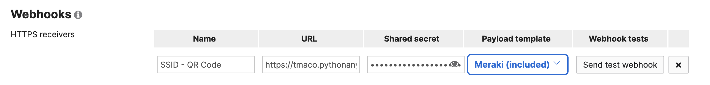
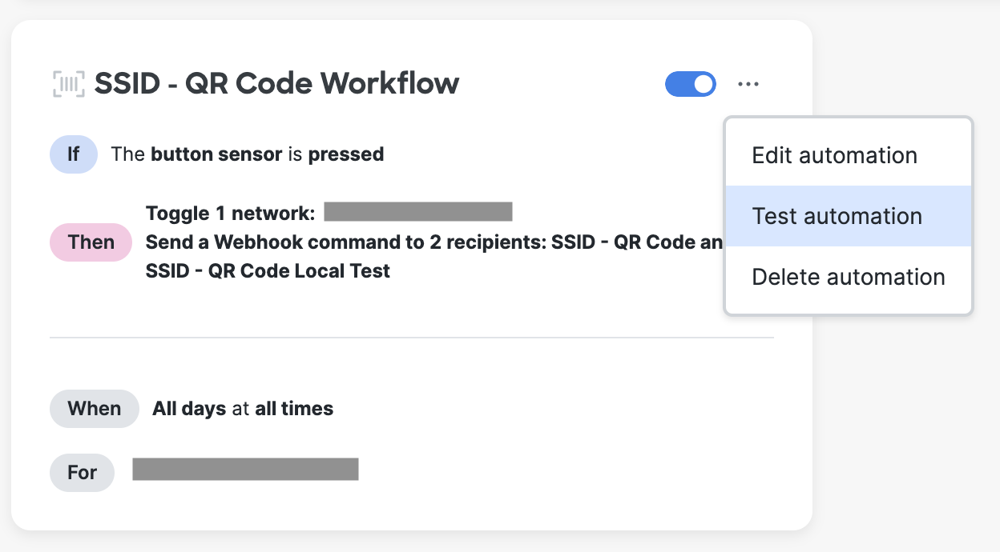
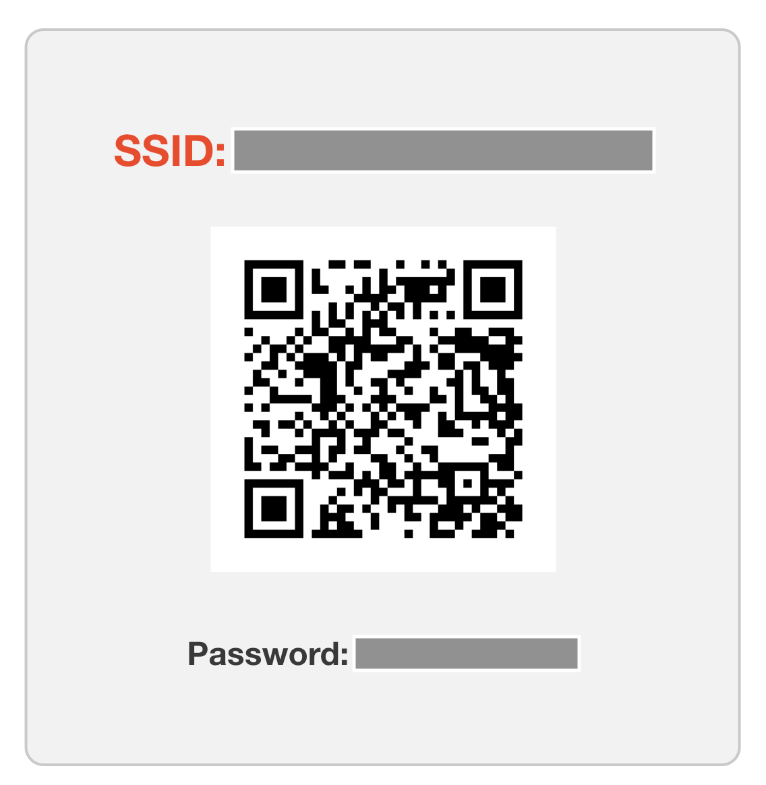
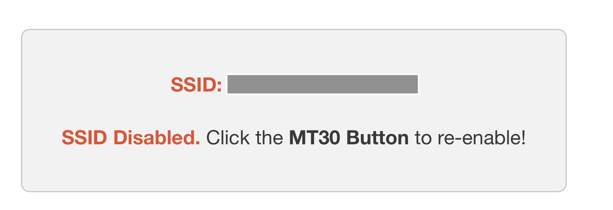
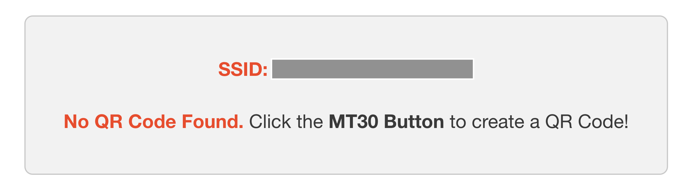

# Meraki MT30 Button Wi-Fi QR Code Generator

Use a Meraki MT30 button to enabled/disable a Meraki Wi-Fi SSID and generate a QR code allowing users to join the Wi-Fi network.

The password (and corresponding QR code) is randomized every time the button is pressed.

**Note:**
Only Open and PSK Authentication modes are supported at this time.


## Contacts
* Trevor Maco

## Solution Components
* Meraki MT30
* Flask
* Python 3.11

## Prerequisites

### MT30 Button
Ensure a MT30 button is claimed and licensed in the Meraki Org. Follow the button setup and installation guide [here](https://documentation.meraki.com/MT/MT_Installation_Guides/MT30_Installation_Guide_-_Smart_Automation_Button)

### Meraki API Keys
In order to use the Meraki API, you need to enable the API for your organization first. After enabling API access, you can generate an API key. Follow these instructions to enable API access and generate an API key:
1. Login to the Meraki dashboard
2. In the left-hand menu, navigate to `Organization > Settings > Dashboard API access`
3. Click on `Enable access to the Cisco Meraki Dashboard API`
4. Go to `My Profile > API access`
5. Under API access, click on `Generate API key`
6. Save the API key in a safe place. The API key will only be shown once for security purposes, so it is very important to take note of the key then. In case you lose the key, then you have to revoke the key and a generate a new key. Moreover, there is a limit of only two API keys per profile.

> For more information on how to generate an API key, please click [here](https://developer.cisco.com/meraki/api-v1/#!authorization/authorization). 

> Note: You can add your account as Full Organization Admin to your organizations by following the instructions [here](https://documentation.meraki.com/General_Administration/Managing_Dashboard_Access/Managing_Dashboard_Administrators_and_Permissions).

### Make Local Application Reachable of the Internet
The script requires being reachable over an internet accessible URL to receive the Meraki MT30 Webhook events. Therefore, it can be deployed on different IaaS platforms like Heroku, Amazon Web Services Lambda, Google Cloud Platform (GCP) etc. . For simplicity, we use the tool ngrok here.

1. Download ngrok on the [official website](https://ngrok.com/download).
2. Extract the folder files
3. Run the ngrok.exe by double-clicking on the file
4. Type the command ngrok http 8080 and press enter
5. Note the https redirect URL for a later step


## Installation/Configuration

### Meraki Dashboard

It is required to define a Webhook HTTP server and to configure a MT30 button automation in the Meraki Dashboard for this integration.

*Configure the Webhook in the Meraki Dashboard:*

1. Go to **Network-wide** > **Alerts**

2. Add an **HTTP server** in **Webhooks: HTTP servers** section:
   1. Fill in a **name** for your webhook 
   2. Add [ngrok https url]/**button-press** in the **URL** field 
   3. Choose and fill in a **shared secret**
   


*Configure a Meraki MT30 Button Automation*

1. Go to **Sensors** > **Configure:Automations**
2. Click the  **New Automation** button
3. Fill in a **name** for the automation and click **Next**
4. Choose the **Button** sensor and click **Next**
5. Choose the **Any Press** trigger and click **Next**
6. Check the **Toggle SSID* action*, and select the SSID
7. Check the **Send a Webhook command** action and add the previously defined **Webhook HTTP server** as Webhook recipient.
8. Click **Next**
8. Select the **Always** schedule and click **Next**
9. Select all MT30 buttons to apply the automation to and click **Next**
10. Check the preview and press **Finish and Save**



## Script setup

1. Clone this repository with `git clone [repository name]`
2. Add Meraki API key, Webhook shared secret, Meraki org name, Meraki network name (containing SSID), and SSID name to environment variables located in `config.py` 
```python
MERAKI_API_KEY = ""
SHARED_SECRET = ""
ORG_NAME = ""
NETWORK_NAME = ""
SSID_NAME = ""
```
3. Set up a Python virtual environment. Make sure Python 3 is installed in your environment, and if not, you may download Python [here](https://www.python.org/downloads/). Once Python 3 is installed in your environment, you can activate the virtual environment with the instructions found [here](https://docs.python.org/3/tutorial/venv.html).
4. Install the requirements with `pip3 install -r requirements.txt`

## Usage
To run the program, use the command:
```
$ python3 app.py
```
Press the MT30 button, and the automation workflow will trigger.

Navigate to the hosted URL for the flask app (for ex: the ngrok url if running locally), and you will see a QR code generated for the SSID (assuming the SSID was disabled before):



**Note**: it can take up to 30 seconds for the workflow to complete. Please refresh the page if webpage display has not updated.

If the new SSID state is disabled, the following will be displayed:



If this is the first QR code created for the SSID, the following will be displayed:



**Note**: Created QR codes can be found under _static > qr_codes > [ssid name].png_


# Screenshots


### LICENSE

Provided under Cisco Sample Code License, for details see [LICENSE](LICENSE.md)

### CODE_OF_CONDUCT

Our code of conduct is available [here](CODE_OF_CONDUCT.md)

### CONTRIBUTING

See our contributing guidelines [here](CONTRIBUTING.md)

#### DISCLAIMER:
<b>Please note:</b> This script is meant for demo purposes only. All tools/ scripts in this repo are released for use "AS IS" without any warranties of any kind, including, but not limited to their installation, use, or performance. Any use of these scripts and tools is at your own risk. There is no guarantee that they have been through thorough testing in a comparable environment and we are not responsible for any damage or data loss incurred with their use.
You are responsible for reviewing and testing any scripts you run thoroughly before use in any non-testing environment.